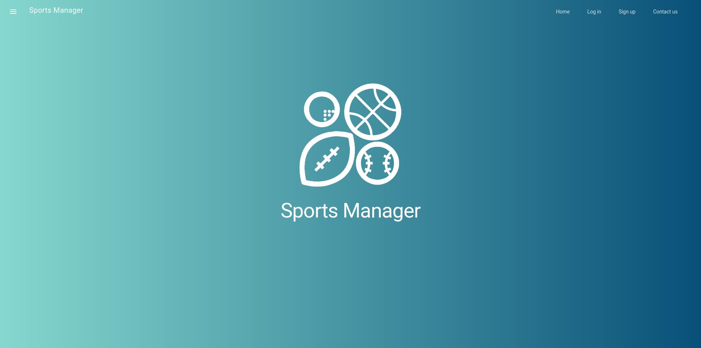

# Projeto de laboratórios de Informática 4

## SportsManager - aplicação para gerir espaços desportivos

*Este repositório contém o projeto SportsManager que se trata de um sistema de reservas de espaços de desporto e aulas temáticas. Este projeto surge no âmbito da disciplina de Laboratórios de Informática IV no 2º semestre do 3º ano do Mestrado Integrado em Engenharia Informática da Universidade do Minho. É uma aplicação baseada em JavaScript e ferramentas Microsoft que tem como público alvo empresas que disponibilizam espaços desportivos e aulas nos mesmos (e.g. ginásios). Assenta a sua importância nas mesmas, visto que possibilita à empresa organizar os seus espaços pelos seus clientes e permite que os mesmos se inscrevam em aulas nesses mesmos espaços.*
